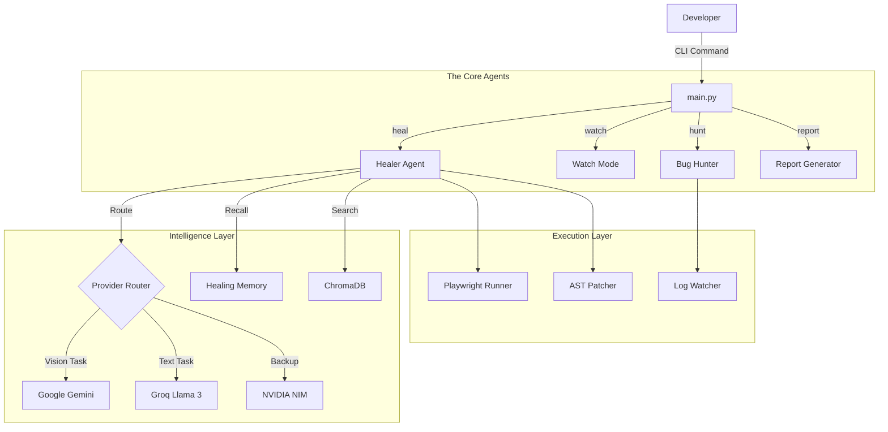

# KernHell 2.0 - System Architecture

KernHell is a **self-healing, multi-agent CLI** designed to run autonomously on the user's machine.

---

## 🏗 High-Level Design

The system follows a "detect-diagnose-patch-verify" loop, orchestrated by `main.py` and powered by multiple specialized agents.

---

## 🧩 Component Breakdown

### 1. The Controller (`main.py`)
- Entry point for all CLI commands (`heal`, `watch`, `hunt`).
- Handles argument parsing and orchestrates the workflow.
- Initializes the `ConfigManager` and ensures API keys are valid.

### 2. The Healer Agent (`healer.py`)
- **Core Logic**: Coordinates the `Scanner` and AI Providers.
- **Router**: Intelligently selects the best AI model based on task type (Vision vs Text) and quota availability.
- **Memory**: Checks `healing_history.json` before calling expensive APIs.
- **Semantic Search**: Queries `ChromaDB` for alternative selectors if exact matches fail.

### 3. The Executioner (`scanner.py`)
- Runs Playwright tests in a subprocess.
- Captures `stdout`, `stderr`, and takes **Screenshots** on failure.
- Compresses images using `Pillow` to reduce token usage by 80%.

### 4. The Surgeon (`patcher.py`)
- Reads the original source file.
- Uses `difflib` and AST parsing to safely inject the AI-generated fix.
- Ensures syntax correctness before saving.

### 5. The Watcher (`main.py` + `watchdog`)
- Monitors file system events in real-time.
- Triggers the `heal` command automatically when a file is saved.
- Debounces events to prevent duplicate runs.

### 6. The Bug Hunter (`bug_hunter.py`)
- Tails server logs in real-time.
- Uses Regex to detect error patterns (Exceptions, Fatal Errors).
- Sends context to AI for root cause analysis.
- Dispatches alerts to **Slack** or **WhatsApp**.

### 7. The Reporter (`report_generator.py`)
- Aggregates data from `db.json` (runs, fixes, costs).
- Generates a standalone HTML dashboard using `Chart.js`.
- Calculates ROI (Time/Money Saved).

---

## 💾 Data Storage (Local-First)

All data lives in `~/.kernhell/`:
- `keys.json`: API Keys (encrypted at rest concept).
- `quota.json`: Daily API usage tracking.
- `healing_history.json`: Semantic memory of past fixes.
- `db.json`: Run history and metrics.

---

## 🔄 Self-Healing Loop

1. **Run Test**: `Scanner` executes the file.
2. **Catch Error**: Detects non-zero exit code.
3. **Capture Context**: Grabs screenshot + error log + source code.
4. **Consult AI**: Sends context to best available provider.
5. **Apply Fix**: `Patcher` rewrites the code.
6. **Verify**: Re-runs the test. If pass -> Success. If fail -> Loop (max 3 retries).
